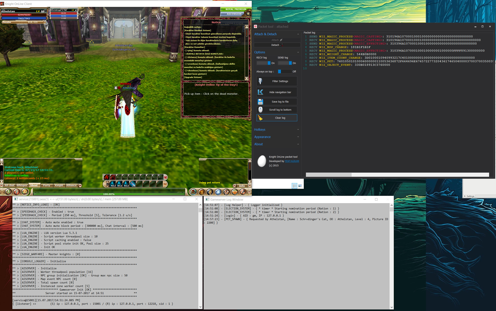

# Knight online packet logger utility

This is a tool I've made in back in day to log communication between knight online servers and the client. It uses trampoline technique to hook packet receive and send functions to intercept and log the data.

This is a screenshot of the tool in action:

This project is for educational purposes only.

Shared under MIT license.

2015, PENTAGRAM
